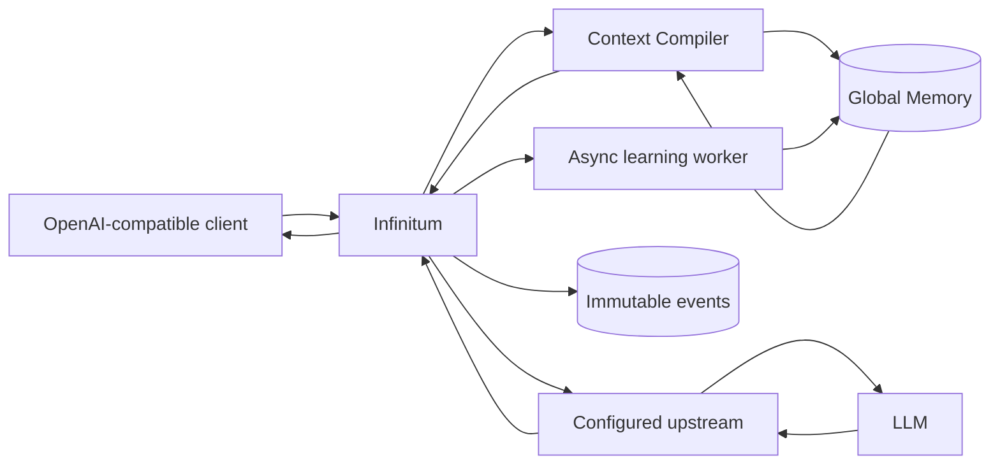
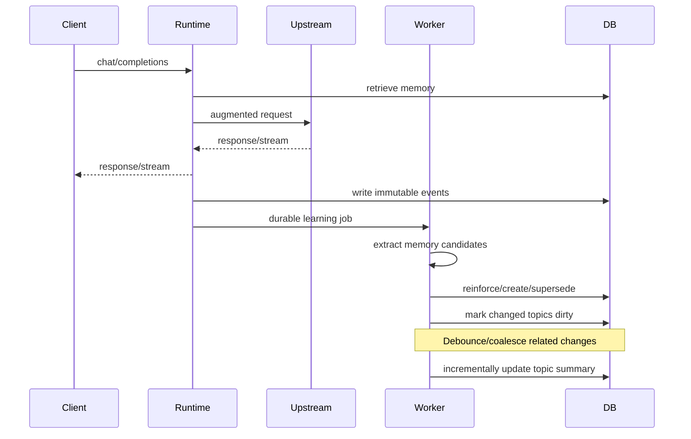

<div align="center">

# Infinitum

**Persistent memory and context for AI.**

[](#)-[](#)-[](https://github.com/aspotton/infinitum/issues)

> 🚧 **Work in progress.** Infinitum is built and works for me, but it is not a
> polished production product yet. Design critiques, use cases, and pull
> requests are welcome — open an issue and tell me what this should become.

</div>

Infinitum is a standalone Python 3 memory and context runtime for AI agents and LLM applications. It exposes an OpenAI-compatible API, maintains durable event-sourced memory, learns and consolidates useful long-term context, and injects only the most relevant memory into each request.

Current release: **v0.2.2**.

## Repository

- **Repository name:** `infinitum`
- **Short description:** Persistent memory and context runtime for AI agents and LLMs with an OpenAI-compatible API.
- **Python distribution:** `infinitum`
- **Python package:** `infinitum`
- **CLI:** `infinitum`

## What changed in v0.2.2

V0.2.2 hardens background learning for OpenAI-compatible servers that return structured output through `message.tool_calls` instead of normal `message.content`. This can happen with Qwen-family models behind an automatic tool-call parser even when Infinitum did not provide any tools. Infinitum now accepts only schema-shaped tool/function arguments that match the memory extraction contract, while unrelated tool calls remain ignored.

The extraction and topic-summary prompts now explicitly tell the model not to call tools or functions. Diagnostics include tool-call count and names, and topic summaries can recover a simple `summary`, `text`, or `content` field from tool-call arguments before falling back to deterministic active-memory summaries.

If your upstream supports standard `tool_choice`, the most defensive local-model configuration is:

```yaml
learning:
  max_tokens: 2048
  extra_body:
    tool_choice: none
    chat_template_kwargs:
      enable_thinking: false
```

`tool_choice: none` addresses the `finish_reason='tool_calls'` case; `enable_thinking: false` addresses reasoning-token consumption. Infinitum v0.2.2 remains resilient if either setting is ignored by the upstream.

## What changed in v0.2.1

V0.2.1 hardens background learning for reasoning-capable/local models. Some OpenAI-compatible servers can return a completion with reasoning tokens but an empty final `message.content`, especially when the completion budget is exhausted before the final answer. Infinitum no longer retries an empty topic-summary response repeatedly. It logs response diagnostics and builds a bounded deterministic summary from active canonical memories, while detailed memories remain authoritative.
Dirty topic updates left behind by an already-failed summary job are also requeued on startup when Infinitum can recover the model from that job, so an in-place upgrade can repair the pending topic without requiring another conversation to touch it.

It also adds `learning.extra_body` so vendor-specific learning controls can be supplied without affecting foreground proxy requests. For a vLLM/Qwen endpoint that supports the Qwen chat-template switch, for example:

```yaml
learning:
  extra_body:
    tool_choice: none
    chat_template_kwargs:
      enable_thinking: false
```

This is often desirable for extraction/summarization because those jobs need concise structured output rather than long reasoning traces.

## What changed in v0.2.0

V0.2.0 gives the project its permanent **Infinitum** identity while preserving the v0.1.x memory architecture and upgrade path.

- renamed the repository/project from Context Runtime to **Infinitum**;
- renamed the primary Python package from `context_runtime` to `infinitum`;
- renamed the primary CLI from `context-runtime` to `infinitum`;
- changed the canonical configuration environment variable to `INFINITUM_CONFIG`;
- changed canonical runtime headers from `X-Context-*` to `X-Infinitum-*`;
- changed the injected memory envelope from `<runtime_memory>` to `<infinitum_memory>`;
- changed the default new-database filename to `infinitum.db`;
- retained compatibility aliases for the old CLI, Python namespace, `CONTEXT_RUNTIME_CONFIG`, and `X-Context-*` request headers;
- when no database path is explicitly configured, an existing `./context-runtime.db` is detected and reused instead of silently creating an empty `./infinitum.db`;
- keeps the v0.1.4 OpenCode user/project/CWD provenance and soft-affinity behavior;
- keeps v0.1.3 semantic reinforcement and v0.1.2 bounded incremental topic summaries.

The current release still intentionally uses **one global memory namespace**. User/project/CWD metadata improves provenance and retrieval affinity but is not yet an authorization boundary. Hard scoped memory remains roadmap work.

### Upgrading from v0.1.x

Existing memory databases remain compatible. The safest upgrade is to keep your current `memory.database_path` unchanged. If you relied on the old implicit default and `./context-runtime.db` exists, Infinitum will automatically reuse it unless `./infinitum.db` already exists. No memory rewrite is performed during the rename.

Legacy compatibility is deliberate but secondary: new integrations should use `infinitum`, `INFINITUM_CONFIG`, and `X-Infinitum-*`.

See [`docs/MIGRATION_FROM_CONTEXT_RUNTIME.md`](docs/MIGRATION_FROM_CONTEXT_RUNTIME.md) for a concise in-place upgrade checklist.

## What it does



A client changes only its `base_url`:

```python
from openai import OpenAI

client = OpenAI(
    base_url="http://localhost:8788/v1",
    api_key="your-upstream-key",
)

response = client.chat.completions.create(
    model="your-model",
    messages=[{"role": "user", "content": "What database did we decide to use?"}],
)
```

Infinitum retrieves useful memories, injects a bounded memory block, forwards the request, returns the upstream response, stores the raw interaction as events, then learns asynchronously.

## Memory model

The current memory pipeline has three layers:

```text
Immutable events
    -> detailed derived memories
        -> topic summaries
```

Raw events are the source of truth. Memories are derived state and can be merged, reinforced, superseded, contested, or archived without destroying history.

Supported memory types:

- `fact`
- `decision`
- `preference`
- `goal`
- `procedure`
- `lesson`
- `episodic`

Supported lifecycle states:

- `active`
- `superseded`
- `contested`
- `archived`

## Retrieval and context compilation

Retrieval is not just nearest-vector search. Each active memory is scored from a configurable combination of:

- semantic similarity when embeddings are enabled
- lexical relevance
- memory importance
- confidence
- freshness
- topic relevance
- optional user/project/CWD provenance affinity after the memory is already relevant

The Context Compiler then:

1. retrieves broadly;
2. ignores non-active memory;
3. removes near duplicates;
4. includes relevant topic summaries;
5. ranks detailed memories;
6. calculates the actual token budget remaining in the model window;
7. injects only memories that fit and add value;
8. records exactly which memories were injected into each request.

The configured memory budget is a ceiling, not a target.

## Learning

Learning occurs after the user has already received the model response.



The extraction LLM is only allowed to **propose** memory candidates. Deterministic code performs database mutations. This prevents an extraction response from directly rewriting memory state.

Repeated evidence reinforces an existing memory instead of creating duplicate records. Explicit corrections can supersede older active memories while the source events remain available.

### Three-timescale memory processing

V0.2.0 continues to separate memory maintenance into three timescales so long-lived memory does not repeatedly resend the entire corpus to an LLM:

```text
EVERY INTERACTION
current interaction + top nearby memories
        -> extract durable memory candidates
        -> deterministic create/reinforce/supersede

INCREMENTAL (implemented in v0.1.2+)
changed memories accumulate per topic
        -> debounce/coalesce bursts
        -> current topic summary + changed records + small context sample
        -> update summary

PERIODIC (roadmap)
large topic/corpus maintenance pass
        -> cluster / canonicalize / detect stale or conflicting state
        -> rebuild derived summaries/indexes when justified
```

The incremental path is intentionally bounded. A topic summary is bootstrapped once from a limited sample, then later updates use the existing summary plus only a bounded batch of changed memories and a small active-topic context sample. If the same topic changes several times quickly, those changes are coalesced into one background summary job.

### Reinforcement and `observation_count`

A newly created canonical memory starts with `observation_count = 1`. Later independent interactions increase that count only when the new candidate is judged equivalent to the same active memory. V0.2.0 uses the same guarded cascade introduced in V0.1.3:

```text
exact type + topic compatibility
        |
        +-- high lexical equivalence ------> reinforce
        |
        +-- high embedding similarity ----> reinforce
        |
        +-- learner says reinforce
              + retrieval/similarity guards
              + optional reinforces_memory_id
                         |
                         +------------------> reinforce

otherwise -------------------------------> create a new memory

explicit correction / supersede ----------> never reinforce
```

`observation_count` is deliberately **not** treated as truth or authority. It means that multiple distinct interactions supported the current canonical memory. One newer explicit correction may still supersede a memory that has many older observations. Reprocessing the same source event IDs is idempotent and does not increment the count again.

Useful tuning controls:

```yaml
memory:
  reinforce_similarity: 0.86
  reinforce_semantic_similarity: 0.90
  reinforce_hint_min_score: 0.55
  reinforce_hint_min_lexical: 0.40
  reinforce_hint_min_semantic: 0.72
```

The long-term roadmap replaces the integer-only evidence model with first-class `memory_observations` records so observation source, independence, evidence type, confidence, and weight are all auditable.

## Install

Python 3.12 or newer is required.

```bash
python3 -m venv .venv
source .venv/bin/activate
pip install -e .
cp config.example.yaml config.yaml
```

Optional exact token counting:

```bash
pip install -e '.[tokenizer]'
```

Start the service:

```bash
infinitum serve --config config.yaml
```

or:

```bash
INFINITUM_CONFIG=config.yaml uvicorn infinitum.app:app --host 0.0.0.0 --port 8788
```

## Configuration

A minimal setup:

```yaml
upstream:
  base_url: http://localhost:4000/v1
  passthrough_authorization: true

memory:
  database_path: ./infinitum.db

learning:
  enabled: true

embeddings:
  enabled: false
```

With `passthrough_authorization: true`, the inbound `Authorization` header is forwarded to the upstream. Background learning cannot reuse a per-request key after the request ends, so either configure a service key under `learning.api_key` or configure `upstream.api_key` when the learning endpoint requires authentication.

### OpenCode / request-context headers

V0.2.0 can associate an OpenAI request with a user/project/CWD while keeping the memory store globally visible. Prefer the canonical headers:

```text
X-Infinitum-User-ID: adam
X-Infinitum-Project-ID: infinitum
X-Infinitum-CWD: /home/adam/infinitum
```

Pre-v0.2 `X-Context-User-ID`, `X-Context-Project-ID`, and `X-Context-CWD` are still accepted as lower-priority compatibility aliases.

An explicit project ID is preferred. If it is omitted but CWD is supplied, the runtime normalizes the path and derives a stable local key such as `cwd:infinitum:<hash>`. The full CWD is stored separately for provenance.

The default resolver also accepts common aliases so an existing OpenCode/Headroom setup can be reused:

```text
X-OpenCode-User-ID / X-OpenCode-User
X-OpenCode-Project-ID / X-OpenCode-Project
X-OpenCode-Directory / X-OpenCode-CWD

X-Headroom-User-ID
X-Headroom-Project-ID
X-Headroom-CWD

X-LiteLLM-User-ID
```

Header priority is the order configured under `request_context.*_headers`; canonical `X-Infinitum-*` values are first by default. Header names are configurable. OpenCode's own server/client path uses `x-opencode-directory` for directory context, so V0.2.0 recognizes it directly.

For session continuity, the Chat Completions route also recognizes `X-Infinitum-Session-ID`, `X-OpenCode-Session`, `X-Session-Id`, and `X-Session-Affinity` in that order. This lets OpenCode's normal compatible-provider session headers become the Infinitum `session_id` without extra client configuration.

A typical OpenCode provider configuration can send the local user and launch directory as custom headers, for example:

```jsonc
{
  "provider": {
    "infinitum": {
      "options": {
        "baseURL": "http://infinitum:8788/v1",
        "headers": {
          "x-infinitum-user-id": "{env:USER}",
          "x-infinitum-cwd": "{env:PWD}"
        }
      }
    }
  }
}
```

If you have a stable project identifier, send `x-infinitum-project-id` as well rather than depending only on CWD. `PWD` reflects the environment presented to the OpenCode process; it is not a repository-discovery protocol.

The resolved context affects retrieval only as a **soft affinity**:

```text
normal global relevance scoring
        |
        +-- below relevance floor -> reject
        |
        +-- relevant -> add bounded affinity bonus
                         same project > same user > exact CWD
```

This means a same-project memory can outrank an equally relevant memory learned elsewhere, but an unrelated same-project memory cannot become eligible solely because of project affinity. All V0.2.0 memory is still globally visible. These headers are therefore **not authentication and not a security boundary**. Hard user/project isolation is still Phase 3/4 roadmap work and must filter scope before semantic retrieval.

Useful configuration:

```yaml
request_context:
  enabled: true
  derive_project_from_cwd: true
  user_affinity_bonus: 0.03
  project_affinity_bonus: 0.07
  cwd_affinity_bonus: 0.01
  forward_to_headroom: false
```

Consumed aliases are stripped from normal upstream forwarding. When the immediate upstream is Headroom, set `forward_to_headroom: true`; Infinitum will emit canonical `x-headroom-*` values from the resolved context instead of blindly forwarding inbound identity-like headers.

`X-Infinitum-Debug: true` additionally returns the resolved user/project IDs (when present) and whether the project was derived from CWD. `GET /request-context` can be called directly to inspect resolution without invoking a model.

### Embeddings

Embeddings are optional. Without them, retrieval remains functional using lexical, topic, recency, importance, and confidence signals.

```yaml
embeddings:
  enabled: true
  base_url: http://embedding-server:8000/v1
  api_key: ${EMBEDDING_API_KEY:-}
  model: text-embedding-3-small
```

Any OpenAI-compatible `/v1/embeddings` implementation can be used.

### Separate learning model

```yaml
learning:
  enabled: true
  base_url: http://litellm:4000/v1
  api_key: ${LEARNING_API_KEY:-}
  model: memory-extractor
  timeout_seconds: 600
  max_tokens: 2048
```

If `learning.model` is empty, the original answering model is reused.


### Slow local learning models and timeouts

Memory extraction runs after the foreground response and uses a non-streaming
Chat Completions request. V0.1.1+ gives learning its own timeout and caps the
completion length so reasoning/local models cannot silently inherit an
unbounded generation budget.

```yaml
learning:
  timeout_seconds: 600
  max_tokens: 2048
  extra_body: {}
```

If a learning request times out, the user's original chat response is unaffected.
The durable job remains eligible for retry up to `learning.max_attempts`. For a
slow local model, increase `timeout_seconds`; if the model tends to reason at
length, configure a faster dedicated extraction model or disable thinking for
background learning when your OpenAI-compatible server exposes such a control.

For vLLM/Qwen deployments that support `chat_template_kwargs`, a useful setup is:

```yaml
learning:
  extra_body:
    tool_choice: none
    chat_template_kwargs:
      enable_thinking: false
```

`extra_body` is merged only into background learning Chat Completions. Infinitum's
core `model`, `messages`, `stream: false`, and configured token cap remain authoritative.

### Incremental topic-summary controls

V0.1.2+ no longer regenerates a topic summary from up to 100 topic memories after every learned interaction. Changed memory IDs are persisted as dirty topic state, and one debounced background job updates the existing summary.

```yaml
learning:
  topic_summaries: true
  topic_summary_min_memories: 3
  topic_summary_debounce_seconds: 30
  topic_summary_update_threshold: 5
  topic_summary_max_changed_memories: 24
  topic_summary_context_memories: 8
  topic_summary_bootstrap_max_memories: 32
  topic_summary_max_tokens: 1024
  topic_summary_fallback_memories: 12
```

- `debounce_seconds`: wait for a quiet period before summarizing a burst of changes.
- `update_threshold`: if this many dirty memories accumulate, make the summary job immediately eligible.
- `max_changed_memories`: maximum dirty records consumed by one summary call.
- `context_memories`: small active-topic sample supplied beside the changed records.
- `bootstrap_max_memories`: bounded sample used only when a topic has no existing summary yet.
- `fallback_memories`: maximum active canonical memories used when the learning model returns no final summary text.

Dirty state is cleared only after a usable model summary or the deterministic active-memory fallback has been persisted. If new evidence arrives while a summary is running, it remains dirty and is scheduled for a follow-up rather than being lost.

## OpenAI-compatible endpoints

### `POST /v1/chat/completions`

Supports normal and streaming Chat Completions. Unknown request fields are preserved and forwarded upstream.

### `GET /v1/models`

Transparent upstream passthrough.

## Runtime-specific endpoints

### `GET /health`

Returns service and feature status.

### `GET /memory`

Lists memories. Optional `status` query parameter.

### `POST /memory`

Manually inserts a memory.

```json
{
  "memory_type": "goal",
  "topic": "runtime",
  "content": "Build an effective persistent memory layer for LLMs.",
  "importance": 1.0,
  "confidence": 1.0
}
```

### `POST /memory/search`

```json
{
  "query": "database choice",
  "limit": 20
}
```

### `GET /memory/{id}`

Returns memory plus provenance event IDs.

### `DELETE /memory/{id}`

Archives the memory rather than destroying historical events.

### `GET /events`

Inspects immutable events. `session_id`, `user_id`, and `project_id` can be supplied to filter.

### `GET /request-context`

Returns the user/project/CWD context resolved from the current request headers. This is a diagnostic endpoint and does not authenticate the caller.

### `GET /topics`

Lists generated multi-memory topic summaries.

## Per-request controls

Internal headers are stripped before forwarding upstream.

```text
X-Infinitum-Memory: off
X-Infinitum-Learning: off
X-Infinitum-Session-ID: my-session-id
# Also accepted: X-OpenCode-Session / X-Session-Id / X-Session-Affinity
X-Infinitum-User-ID: adam
X-Infinitum-Project-ID: infinitum
X-Infinitum-CWD: /home/adam/infinitum
X-Infinitum-Debug: true
```

The corresponding pre-v0.2 `X-Context-*` control headers are still accepted for compatibility, but new clients should use the Infinitum names.

`X-Infinitum-Debug: true` adds response metadata such as the number of detailed memories injected, token budget used, resolved user/project IDs, and whether project identity was derived from CWD. It intentionally does not return the full CWD in response headers.

## Persistence

The current global-memory prototype intentionally uses one SQLite database so the complete system can run with no external infrastructure.

Main tables:

- `events`
- `memories`
- `memory_sources`
- `memory_embeddings`
- `topics`
- `topic_updates` (dirty incremental-summary state)
- `requests`
- `request_memories`
- `jobs`

`events` and `requests` carry nullable `user_id`, `project_id`, and `cwd` provenance columns in V0.2.0. Existing databases are migrated in place.

SQLite WAL mode is enabled. FTS5 is used when available. Embedding vectors are stored as float32 blobs and searched in-process, which is deliberately simple and appropriate for the first global-memory prototype.

## Headroom and LiteLLM

Infinitum is independent of both. The configured upstream can be either one.

```text
OpenCode -> Infinitum -> Headroom -> LiteLLM -> model
```

or:

```text
OpenCode -> Infinitum -> LiteLLM -> model
```

or:

```text
application -> Infinitum -> vLLM
```

The intended responsibility split is:

- **Infinitum:** what knowledge should the model know now?
- **Headroom:** how can the selected context be represented efficiently?
- **LiteLLM:** authentication, routing, provider policy, budgets, fallbacks.

When Headroom is the immediate upstream, `request_context.forward_to_headroom: true` forwards the resolved context as canonical `x-headroom-*` headers. Leave it false when the downstream does not need those hints.

## Current limitations

V0.2.0 is deliberately not yet a multi-user production memory service.

- all memory is global;
- request user/project/CWD context is provenance + ranking affinity only; there is still no user/project/org isolation;
- no ACL/RBAC system;
- SQLite and in-process vector scan are single-node choices;
- Chat Completions is implemented before the Responses API;
- streaming learning occurs only after a complete `[DONE]` stream;
- contradiction/supersession relies on conservative LLM candidate hints plus deterministic validation;
- topic summaries use the configured learning model and are incrementally maintained;
- raw request-message events may contain sensitive content and require appropriate storage controls;
- no document ingestion or graph retrieval yet.

See [`docs/ROADMAP.md`](docs/ROADMAP.md) for the intended evolution and enough design detail to implement it without changing the core event/memory model.

## Design principles

1. Events are truth; memory is derived.
2. Retrieval scope must eventually be enforced before semantic search.
3. The LLM may propose memory changes but deterministic code owns mutation.
4. Current state can supersede old state without destroying history.
5. Huge memory availability does not justify filling the model context window.
6. Provenance is required for every derived memory.
7. Learning must normally be off the critical response path.
8. Failure of optional memory features should not silently broaden access.
9. Model/provider infrastructure remains replaceable.
10. The system should always be able to explain why a memory exists and why it was selected.
