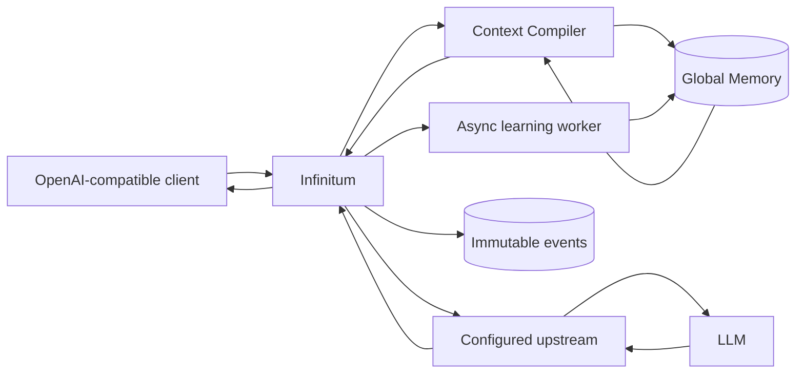
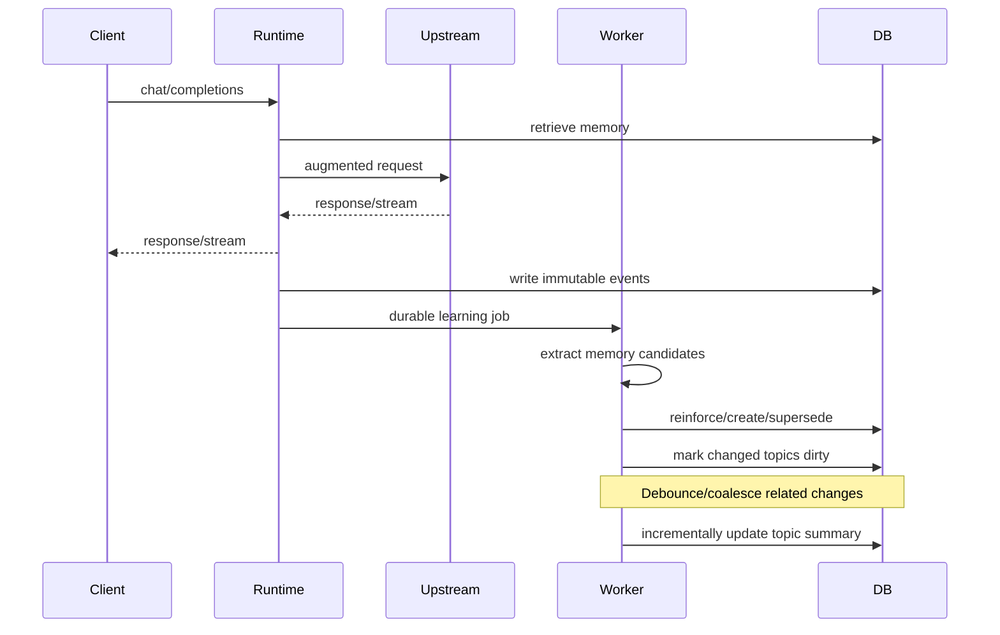

<div align="center">


# Infinitum

**Persistent memory and context for AI.**

[](#)-[](#)-[](https://github.com/aspotton/infinitum/issues)

> 🚧 **Work in progress.** Infinitum is built and works for me, but it is not a
> polished production product yet. Design critiques, use cases, and pull
> requests are welcome — open an issue and tell me what this should become.

</div>

Infinitum is a standalone Python 3 memory and context runtime for AI agents and LLM applications. It exposes an OpenAI-compatible API, maintains durable event-sourced memory, learns and consolidates useful long-term context, and injects only the most relevant memory into each request.

## Why Infinitum exists

The newer AI services — OpenAI, Claude, and the rest — now ship their own memory. Their agents remember your decisions, your preferences, the things you already explained once, and that continuity makes them noticeably better at reasoning and recall and simply more useful to have around.

Local AI doesn't have that. Worse, the moment you want to try a new tool or switch between providers, frameworks, and models, you leave that "magic" memory behind — it's locked inside whichever service learned it.

Infinitum moves the memory out of the service and into a runtime that sits in front of whatever you point it at. It learns from your interactions and improves the general intelligence of whatever tool or service you happen to want to use today. Bring your own model, bring your own agent framework, switch whenever you like — the memory keeps compounding. No memory exports, no tricks, no workarounds.

Current release: **v0.4.0**.

Full release history lives in [CHANGELOG.md](CHANGELOG.md).

## Repository

- **Repository name:** `infinitum`
- **Short description:** Persistent memory and context runtime for AI agents and LLMs with an OpenAI-compatible API.
- **Python distribution:** `infinitum`
- **Python package:** `infinitum`
- **CLI:** `infinitum`

## What it does



A client changes only its `base_url`:

```python
from openai import OpenAI

client = OpenAI(
    base_url="http://localhost:8788/v1",
    api_key="your-upstream-key",
)

response = client.chat.completions.create(
    model="your-model",
    messages=[{"role": "user", "content": "What database did we decide to use?"}],
)
```

Infinitum retrieves useful memories, injects a bounded memory block, forwards the request, returns the upstream response, stores the raw interaction as events, then learns asynchronously.

## Memory model

The current memory pipeline has three layers:

```text
Immutable events
    -> detailed derived memories
        -> topic summaries
```

Raw events are the source of truth. Memories are derived state and can be merged, reinforced, superseded, contested, or archived without destroying history.

Supported memory types:

- `fact`
- `decision`
- `preference`
- `goal`
- `procedure`
- `lesson`
- `episodic`

Supported lifecycle states:

- `active`
- `superseded`
- `contested`
- `archived`

## Retrieval and context compilation

Retrieval is not just nearest-vector search. Each active memory is scored from a configurable combination of:

- semantic similarity when embeddings are enabled
- lexical relevance
- memory importance
- confidence
- freshness
- topic relevance
- optional user/project/CWD provenance affinity after the memory is already relevant

Eligibility requires at least one genuine relevance signal (semantic, lexical, or topic) before the query-independent terms like importance, confidence, and freshness can qualify a memory. The same scorer, and hence the same gate, also backs the drill-down memory tools and `POST /memory/search`.

The Context Compiler then:

1. retrieves broadly;
2. ignores non-active memory;
3. removes near duplicates;
4. includes relevant topic summaries;
5. ranks detailed memories;
6. calculates the actual token budget remaining in the model window;
7. injects only memories that fit and add value;
8. records exactly which memories were injected into each request.

The configured memory budget is a ceiling, not a target.

The compiled block is built to be cache-stable across turns; the mechanics are in [docs/ARCHITECTURE.md](docs/ARCHITECTURE.md). Configuration keys are in [docs/CONFIGURATION.md](docs/CONFIGURATION.md).

### Deep retrieval tools

The compiler injects a bounded memory block per request. When the model needs more than that block shows, optional read-only tools let it drill deeper.

When enabled, Infinitum appends two function tools to the client's tool list on every memory-enabled request, as long as the client has not defined a tool of the same name:

- `infinitum_memory_search(query, limit)` — ranked search over active memories (default limit 10, max 50);
- `infinitum_memory_get(memory_id)` — full current content plus provenance source event ids for one memory.

The tools use the same scorer as injection, so results are ranked identically. They read the same global namespace, and request user/project/CWD context stays a soft affinity, never an access-control filter.

The tool loop runs server-side and is transparent to the client: visible text, invisible machinery. The behavior contract, latency edges, and parser notes are in [docs/API.md](docs/API.md), and enabling the tools via `memory.tools_enabled` is documented in [docs/CONFIGURATION.md](docs/CONFIGURATION.md).

## Learning

Learning occurs after the user has already received the model response.



The extraction LLM is only allowed to **propose** memory candidates. Deterministic code performs database mutations. This prevents an extraction response from directly rewriting memory state.

Repeated evidence reinforces an existing memory instead of creating duplicate records. Explicit corrections can supersede older active memories while the source events remain available.

### Three-timescale memory processing

V0.2.0 continues to separate memory maintenance into three timescales so long-lived memory does not repeatedly resend the entire corpus to an LLM:

```text
EVERY INTERACTION
current interaction + top nearby memories
        -> extract durable memory candidates
        -> deterministic create/reinforce/supersede

INCREMENTAL (implemented in v0.1.2+)
changed memories accumulate per topic
        -> debounce/coalesce bursts
        -> current topic summary + changed records + small context sample
        -> update summary

PERIODIC (roadmap)
large topic/corpus maintenance pass
        -> cluster / canonicalize / detect stale or conflicting state
        -> rebuild derived summaries/indexes when justified
```

The incremental path is intentionally bounded. A topic summary is bootstrapped once from a limited sample, then later updates use the existing summary plus only a bounded batch of changed memories and a small active-topic context sample. If the same topic changes several times quickly, those changes are coalesced into one background summary job.

### Reinforcement and `observation_count`

A newly created canonical memory starts with `observation_count = 1`. Later independent interactions increase that count only when the new candidate is judged equivalent to the same active memory. V0.2.0 uses the same guarded cascade introduced in V0.1.3:

```text
exact type + topic compatibility
        |
        +-- high lexical equivalence ------> reinforce
        |
        +-- high embedding similarity ----> reinforce
        |
        +-- learner says reinforce
              + retrieval/similarity guards
              + optional reinforces_memory_id
                         |
                         +------------------> reinforce

otherwise -------------------------------> create a new memory

explicit correction / supersede ----------> never reinforce
```

`observation_count` is deliberately **not** treated as truth or authority. It means that multiple distinct interactions supported the current canonical memory. One newer explicit correction may still supersede a memory that has many older observations. Reprocessing the same source event IDs is idempotent and does not increment the count again.

Tuning knobs are documented in [docs/CONFIGURATION.md](docs/CONFIGURATION.md#reinforcement-tuning-knobs); the first-class `memory_observations` evidence model is roadmap work ([docs/ROADMAP.md](docs/ROADMAP.md)).

## A sample setup that works for me

The primary maintainer runs a local Qwen model on an NVIDIA DGX Spark, with Infinitum pointing directly at it. The full working YAML lives in [docs/CONFIGURATION.md](docs/CONFIGURATION.md#sample-setup-that-works-for-me).

## Install

Python 3.12 or newer is required.

```bash
python3 -m venv .venv
source .venv/bin/activate
pip install -e .
cp config.example.yaml config.yaml
```

Optional exact token counting:

```bash
pip install -e '.[tokenizer]'
```

Start the service:

```bash
infinitum serve --config config.yaml
```

or:

```bash
INFINITUM_CONFIG=config.yaml uvicorn infinitum.app:app --host 0.0.0.0 --port 8788
```

### Run with Docker

```bash
docker run -d --name infinitum --restart unless-stopped \
  --user $(id -u):$(id -g) \
  -p 8788:8788 \
  --add-host=host.docker.internal:host-gateway \
  -v ~/infinitum/config.yaml:/config/config.yaml:ro \
  -v ~/infinitum/db:/db \
  -e UPSTREAM_API_KEY=replace-me \
  ghcr.io/aspotton/infinitum:v0.4.0
```

Setup, verification, and upgrade/backup details: [docs/DOCKER.md](docs/DOCKER.md).

## Configuration

A minimal setup:

```yaml
upstream:
  base_url: http://localhost:4000/v1
  passthrough_authorization: true

memory:
  database_path: ./infinitum.db

learning:
  enabled: true

embeddings:
  enabled: false
```

With `passthrough_authorization: true`, the inbound `Authorization` header is forwarded to the upstream; the background-learning key caveat is documented in [docs/CONFIGURATION.md](docs/CONFIGURATION.md#minimal-config).

Everything else is reference material in [docs/CONFIGURATION.md](docs/CONFIGURATION.md):

- [Request-context and OpenCode headers](docs/CONFIGURATION.md#request-context-and-opencode-headers): canonical `X-Infinitum-*` headers, plus the OpenCode/Headroom/LiteLLM integration aliases.
- [Embeddings](docs/CONFIGURATION.md#embeddings) are optional and configured there.
- Learning controls: a separate extraction model, timeouts, [deferral while the upstream is busy](docs/CONFIGURATION.md#deferring-learning-while-the-upstream-is-busy), and incremental [topic summaries](docs/CONFIGURATION.md#incremental-topic-summary-controls).

## Endpoints and request controls

Infinitum exposes an OpenAI-compatible surface (`POST /v1/chat/completions`, `GET /v1/models`) plus runtime endpoints for inspecting memories, events, topics, and request context. Internal `X-Infinitum-*` control headers are stripped before forwarding upstream. Full reference: [docs/API.md](docs/API.md).

## Persistence

The current global-memory prototype intentionally uses one SQLite database so the complete system can run with no external infrastructure, and existing databases are migrated in place. SQLite WAL mode is enabled, FTS5 is used when available, and embedding vectors are stored as float32 blobs and searched in-process. Table list and ER detail: [docs/ARCHITECTURE.md](docs/ARCHITECTURE.md#storage-model).

## Headroom and LiteLLM

Infinitum is independent of both. The configured upstream can be either one.

```text
OpenCode -> Infinitum -> Headroom -> LiteLLM -> model
OpenCode -> Infinitum -> LiteLLM -> model
application -> Infinitum -> vLLM
```

The intended responsibility split is:

- **Infinitum:** what knowledge should the model know now?
- **Headroom:** how can the selected context be represented efficiently?
- **LiteLLM:** authentication, routing, provider policy, budgets, fallbacks.

Context forwarding is configured in [docs/CONFIGURATION.md](docs/CONFIGURATION.md#request-context-and-opencode-headers).

## Current limitations

V0.2.0 is deliberately not yet a multi-user production memory service.

- all memory is global;
- request user/project/CWD context is provenance + ranking affinity only; there is still no user/project/org isolation;
- no ACL/RBAC system;
- SQLite and in-process vector scan are single-node choices;
- Chat Completions is implemented before the Responses API;
- streaming learning occurs only after a complete `[DONE]` stream;
- contradiction/supersession relies on conservative LLM candidate hints plus deterministic validation;
- topic summaries use the configured learning model and are incrementally maintained;
- raw request-message events may contain sensitive content and require appropriate storage controls;
- no document ingestion or graph retrieval yet.

See [`docs/ROADMAP.md`](docs/ROADMAP.md) for the intended evolution and enough design detail to implement it without changing the core event/memory model. The research papers and systems techniques that shaped these design choices are recorded in [`docs/REFERENCES.md`](docs/REFERENCES.md).

## Design principles

1. Events are truth; memory is derived.
2. Retrieval scope must eventually be enforced before semantic search.
3. The LLM may propose memory changes but deterministic code owns mutation.
4. Current state can supersede old state without destroying history.
5. Huge memory availability does not justify filling the model context window.
6. Provenance is required for every derived memory.
7. Learning must normally be off the critical response path.
8. Failure of optional memory features should not silently broaden access.
9. Model/provider infrastructure remains replaceable.
10. The system should always be able to explain why a memory exists and why it was selected.
