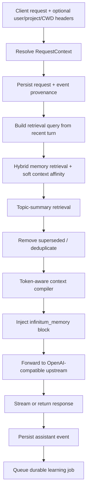
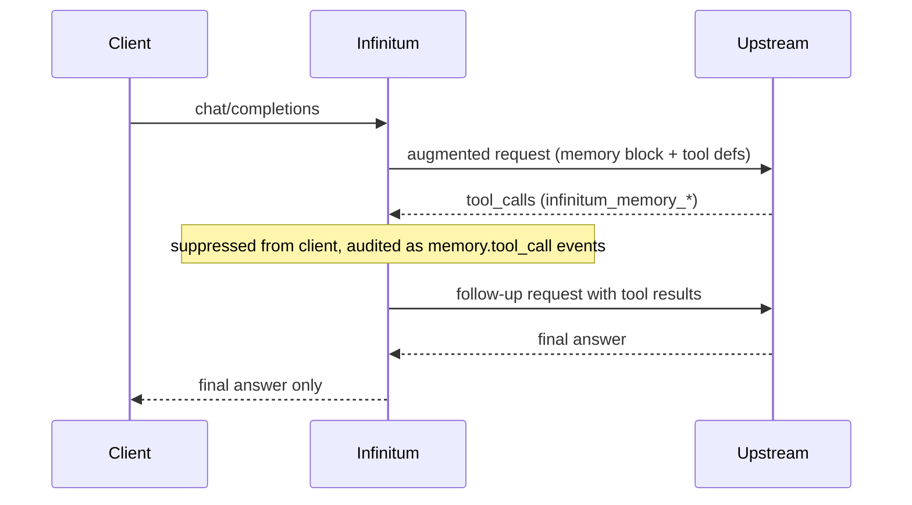
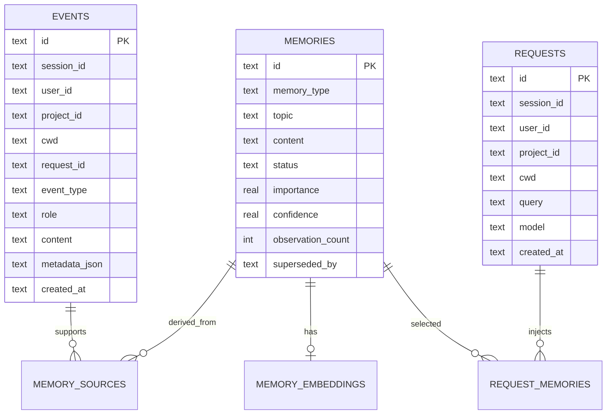
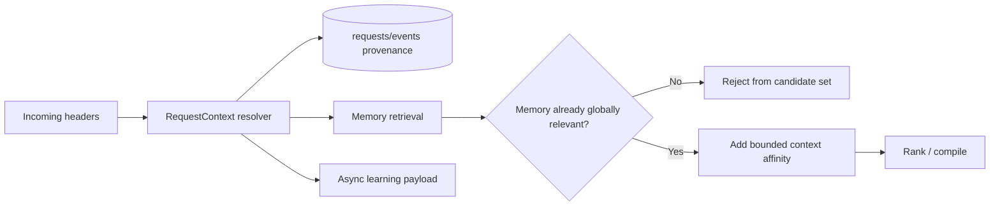
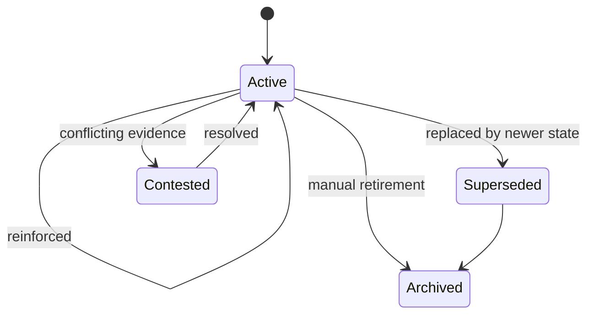
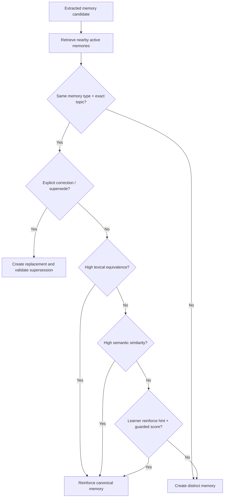
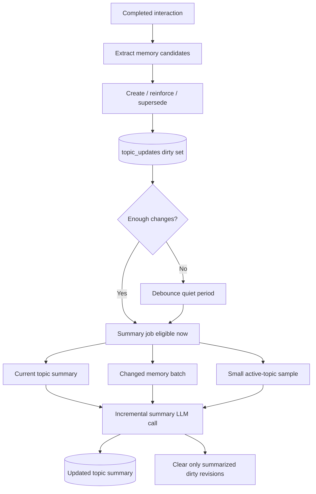

# Infinitum v0.2.7 Architecture

## Request path



The compiled block is designed to be cache-stable. Within one session the block is pinned byte-for-byte and only invalidated when memory or topic state actually changes, tracked by a watermark over the memories and topics tables. The pin applies only when the client supplies a session id (session header or request metadata); a request without one is compiled fresh under a generated, provenance-only id and never enters the block cache. The memory message is injected immediately before the last user message by default (`context.inject_position: suffix`), leaving the system prompt and the conversation history ahead of it byte-identical for upstream prompt caches; `inject_position: prefix` restores injection after the leading system messages for strict chat templates.

## Server-side memory tool loop

With `memory.tools_enabled` and an injected memory block, the request path may run a transparent tool loop before responding:



The loop runs on the foreground path while background learning stays on its usual path afterwards: learning is enqueued exactly once per HTTP request, at final completion. Intermediate rounds never reach the client or the assistant event stream. Each suppressed call is persisted as a `memory.tool_call` event whose metadata carries the reconstructed assistant message (including its `tool_calls`) as the audit trail. The loop caps at 4 rounds; any tool call naming a function other than the two Infinitum tools is terminal and forwarded verbatim.

## Storage model



## Request context and global-memory affinity

V0.2.0 introduces a first-class `RequestContext` containing nullable `user_id`, `project_id`, and `cwd`. The HTTP resolver accepts configurable canonical and compatibility aliases, including OpenCode's `x-opencode-directory`. An explicit project ID wins; otherwise a normalized CWD may produce a deterministic local project key. Chat Completions also recognizes OpenCode-compatible session headers (`x-opencode-session`, `x-session-id`, and `x-session-affinity`) when no explicit `x-infinitum-session-id` is supplied.



The affinity score is deliberately **post-relevance**. A matching project/user/CWD cannot rescue an unrelated memory; it can only reorder memories that already pass the normal global relevance threshold. A canonical memory receives affinity when any of its source events match the current request context. This lets repeated global memories accumulate provenance from multiple projects/users without forcing a scalar owner field onto the memory itself.

The current bonus order is configurable and defaults to project > user > exact CWD. This is convenience and retrieval quality, **not access control**. V0.2.0 still has one globally visible memory namespace and global topic summaries. Future scoped memory must enforce eligibility before vector/lexical ranking.

Consumed context aliases are stripped before normal upstream forwarding. When `request_context.forward_to_headroom` is enabled, Infinitum emits canonical `x-headroom-user-id`, `x-headroom-project-id`, and `x-headroom-cwd` from the resolved context.

Existing V0.1-V0.1.4 SQLite databases are migrated in place: nullable `user_id`, `project_id`, and `cwd` columns are added to `events` and `requests`. Old rows naturally remain context-less legacy/global evidence.

## Why event sourcing is kept

A memory database alone loses the distinction between historical observations and current derived belief. Infinitum therefore stores the raw interaction separately from the memory that the learner derives from it. A bad future consolidation pass can be corrected and memories can be rebuilt without losing the original evidence.

## Supersession



The current implementation creates the replacement memory first and only then marks validated old memories as superseded. Source events remain untouched.

## Reinforcement equivalence

V0.2.0 retains the V0.1.3 rule that retrieval and reinforcement are different decisions. Retrieval may be broad; reinforcement is a mutation and therefore requires stricter compatibility.



The learner may return `reinforces_memory_id` for a memory from the bounded nearby set it was shown. That target is advisory only: the runtime still requires type/topic compatibility and enough lexical/semantic/retrieval evidence. Reinforcement records its decision method and scores in `metadata.last_reinforcement`.

`observation_count` counts distinct supporting learning interactions, not job executions. If the same source event IDs are replayed because a worker retries, reinforcement is idempotent and the count is unchanged. This is still a denormalized early-version measure; the roadmap defines a future explicit observation/evidence table.

## Multi-resolution memory

Detailed memories preserve useful granularity. Topic summaries compress clusters of active memories into current-state summaries.

```text
raw events -> detailed memory -> topic summary
```

At retrieval time, relevant topic summaries can be injected alongside a bounded number of detailed memories from the same topic. This is the first layer of hierarchical memory and becomes more important as the memory corpus grows.

### Incremental summary maintenance

Topic summaries are not regenerated from the complete topic after every interaction. V0.1.2+ persists changed memory IDs in `topic_updates`, coalesces bursts, and updates the existing summary from a bounded delta.



The dirty set is revision-safe: if the same memory changes again while a summary call is running, the newer dirty revision is retained for a follow-up job. Initial topic creation uses a bounded bootstrap sample; subsequent updates do not grow with total topic size.

### Three processing timescales

- **Every interaction:** extract durable memories using the current interaction plus a small nearest-memory set.
- **Incremental:** coalesce topic changes and maintain current topic summaries from deltas. This is implemented in V0.1.2+.
- **Periodic:** future deep consolidation across larger clusters/topics for canonicalization, conflict detection, stale-state cleanup, and rebuilding derived views. See the roadmap.

## Context budgeting

```text
model context window
- existing request/messages
- reserved output
- safety/free-context reserve
= available memory budget

memory budget = min(available memory budget, configured max_memory_tokens)
```

Memories are added in score order only while they fit. The runtime is designed to work with very large context windows without treating the context maximum as a fill target.

## Empty-output resilience for background learning

Background memory extraction and topic summarization are deliberately separate from the foreground response path. Reasoning-capable OpenAI-compatible models may consume their generation budget in reasoning tokens and return an empty final `message.content`. Some model servers also run automatic tool-call parsers and return `finish_reason="tool_calls"` with structured data in `message.tool_calls` even though Infinitum supplied no tools. V0.2.2 treats both cases as output-shape/learning-quality problems rather than blindly replaying work.

For extraction, normal assistant content remains preferred. When it is empty, Infinitum may recover tool/function arguments only when they already match the expected memory schema (`{"memories": [...]}` or one candidate-shaped object). Arbitrary tool calls are ignored. This preserves the deterministic mutation boundary: a tool-call transport does not gain any more authority than ordinary extraction JSON.

For topic summaries, Infinitum records non-content diagnostics, then creates a bounded deterministic summary from current active canonical memories. Detailed memories remain authoritative, so this fallback is safe and can later be replaced by the next successful incremental LLM summary. For interaction extraction, empty final content is logged and produces no candidates; the immutable interaction events remain available for future replay/consolidation tooling.
Because failed summary jobs leave `topic_updates` untouched, startup recovery scans dirty topics and recreates a pending summary job when no pending/running owner exists and the learning model can be recovered from configuration or prior job payload. This lets an upgrade recover topics that previously exhausted their retry count.

`learning.extra_body` allows deployment-specific background controls such as `tool_choice: none` and disabling thinking on compatible servers exposing such controls. These extensions apply only to learning calls; Infinitum still fixes the learning model/messages, forces non-streaming mode, and enforces configured token caps.

## Deferring learning under upstream contention

When the learning model shares an upstream with the answering model, background extraction can steal throughput from user-facing requests. `learning.skip_when_upstream_busy` (default false) adds an optional best-effort gate between the two.

The mechanism is a small in-process counter (`ActiveRequestCounter` in `runtime.py`) incremented only around foreground upstream calls in the Chat Completions proxy route; retrieval and compilation time are never counted. The non-streaming path increments around the request and completion-recording block, and the streaming path hands the byte iterator to a counted wrapper so the decrement runs on normal exhaustion, client disconnect, and error paths alike. The current value is exposed as `active_requests` on `/health`.

When the flag is on, `LearningWorker` checks the counter before `claim_job()`. If any foreground request is in flight, the worker claims nothing, sleeps for one `poll_interval_seconds` in a stop-interruptible way, and tries again on the next poll. Deferred jobs are skipped, never failed: no attempt count is consumed and the durable queue keeps the work until the proxy goes idle. With `learning.upstream_idle_grace_seconds` (default 0) set above zero, deferral extends until the counter has been idle for that long, because the counter also stamps a `last_busy` monotonic timestamp on every effective increment/decrement and any new foreground request restarts that window.

This is single-node best-effort scheduling, not a coordination protocol. A request that starts just after the check overlaps one poll, which is harmless. The decrement saturates at zero, so even a leaked increment cannot permanently starve learning. Already-running jobs are not preempted, and the learner's own upstream calls bypass the counter by design, so a busy worker can never deadlock itself.
