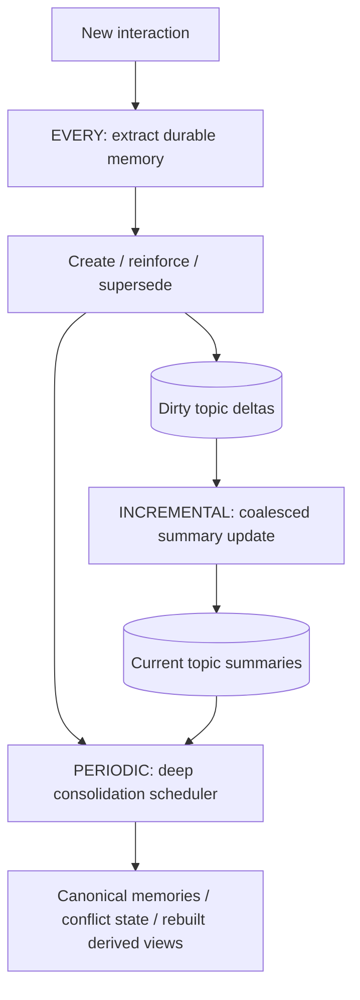
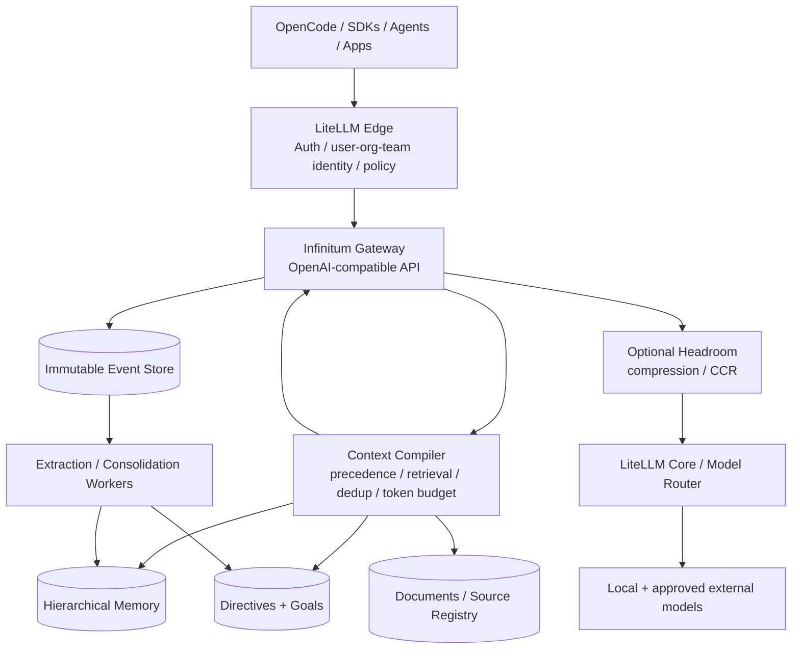

# Infinitum Roadmap

This roadmap describes the intended evolution from the current global-memory runtime into the larger AI Runtime & Context Platform design. The goal is to preserve the event-sourced memory core while adding identity, hierarchical scopes, organization directives, document provenance, deep retrieval, distributed storage, and enterprise governance.

The phases are ordered so each one can be built and validated independently.

---

## Phase 0 — V0.2.0 global intelligent memory

**Status:** implemented in this project.

Core properties:

- OpenAI-compatible `POST /v1/chat/completions` proxy;
- transparent streaming and unknown-field passthrough;
- configurable OpenAI-compatible upstream;
- immutable event history;
- derived memory objects;
- fact/decision/preference/goal/procedure/lesson/episodic types;
- active/superseded/contested/archived lifecycle;
- provenance from memory to source event IDs;
- reinforcement instead of duplicate creation;
- deterministic validation around LLM-proposed memory changes;
- optional OpenAI-compatible embeddings;
- hybrid retrieval;
- multi-resolution topic summaries;
- debounced incremental topic-summary maintenance from changed-memory deltas;
- token-aware context compiler;
- durable background learning jobs;
- request-to-memory audit records;
- OpenCode-compatible user/project/CWD request-context capture and provenance, including `x-opencode-directory`;
- OpenCode-compatible session-header capture (`x-opencode-session`, `x-session-id`, `x-session-affinity`);
- deterministic project-key derivation from CWD when no explicit project ID is present;
- soft same-user/project/CWD retrieval affinity while the namespace remains global;
- optional canonical context forwarding to a downstream Headroom proxy;
- SQLite-only deployment.

The success test is continuity across independent conversations plus correct handling of changed facts.

### Request-context groundwork implemented in V0.2.0

V0.2.0 intentionally implements the **provenance and ranking half** of future scoped memory before implementing authorization. Incoming requests can resolve:

```python
RequestContext(
    user_id="adam",
    project_id="infinitum",
    cwd="/home/adam/infinitum",
)
```

These values are persisted on requests/events, included in learning jobs, and used to softly boost globally relevant memories whose source events share the same context. This provides immediate usefulness in OpenCode while preserving the simple global-memory model.

What V0.2.0 deliberately does **not** do:

- assign an ownership scope to a memory;
- prevent one user/project from retrieving another user's/project's memory;
- trust client headers as authenticated identity;
- create project-specific topic summaries;
- promote/demote memory between global/user/project scopes.

Phase 3 should reuse this `RequestContext` and provenance data but change retrieval from soft affinity to hard **eligible-scope construction before similarity search**. Phase 4 should replace client-trusted user identity with a trusted/signed edge identity.

### Memory processing cadence: every / incremental / periodic

The memory runtime should deliberately operate on three different timescales rather than repeatedly feeding an ever-growing memory corpus back into an LLM. This is a core design principle for future versions.



**Every interaction — implemented:** after a completed model interaction, retrieve only a small set of nearby memories and make one bounded extraction call. The LLM proposes durable facts/decisions/preferences/goals/procedures/lessons/episodes; deterministic code owns create/reinforce/supersede mutations. This is optimized for low latency and immediate continuity.

**Incremental — implemented in V0.1.2+:** memory changes mark their topic dirty. Dirty memory IDs persist independently from the job queue. Related changes are debounced/coalesced; after a quiet period (or after a configurable change threshold), a background call updates the **existing** topic summary from: (1) the current summary, (2) a bounded batch of changed records, and (3) a small current-topic context sample. The entire topic is not resent on every turn. Initial summary creation uses a bounded bootstrap sample. Dirty revisions are cleared only after a successful update, and a memory that changes again while the summary call is running remains dirty for a follow-up.

**Periodic — future deep maintenance:** on a much slower cadence, inspect larger topic clusters or the broader memory corpus. This is where expensive operations belong: global duplicate detection, canonicalization, temporal/conflict reconciliation, cross-topic relationships, stale-memory review, summary rebuilding, embedding/index migrations, and quality repair. Periodic work should be triggerable by time, corpus growth, topic churn, or evaluation signals, and must remain fully reconstructable from immutable events. It should never sit on the foreground request path.

The intended cost model is therefore:

```text
per user turn:        small bounded extraction
per burst/topic:      small bounded delta summary update
occasionally:         larger asynchronous consolidation
```

This makes memory cost grow with **new information and meaningful change**, rather than with total historical memory size.

---

## V0.2.2 structured-output transport resilience

The global-memory runtime now treats OpenAI-compatible `message.content` and schema-shaped tool/function arguments as two possible transports for the same bounded memory-extraction result. This addresses local/Qwen deployments where an automatic tool parser can convert the model's requested JSON into `finish_reason="tool_calls"` even when Infinitum did not advertise tools. The acceptance rule is intentionally narrow: only arguments matching the Infinitum memory schema are consumed; arbitrary tool calls are ignored.

Future structured-learning stages should preserve this principle: distinguish the **semantic result contract** from the provider/model's **wire representation**. Prefer explicit structured-output mechanisms when a backend supports them reliably, but keep provider-neutral parsing/fallbacks and never allow output-transport quirks to bypass deterministic mutation, provenance, scope, or validation rules.

For deployments with aggressive tool parsing, `learning.extra_body.tool_choice: none` is the preferred prevention knob, while parser recovery remains a resilience layer rather than the primary protocol.

## V0.2.1 learning-output resilience

The current global-memory runtime now treats model-generated summaries as an optimization rather than a single point of failure. Empty final output from a reasoning-capable learning model falls back to bounded active canonical memories, and deployment-specific background controls can be supplied through `learning.extra_body`. This principle should carry into periodic consolidation: expensive LLM maintenance must be restartable and optional, while canonical detailed memory and immutable evidence remain usable without it.

## Phase 1 — Evaluation and memory quality loop

Before adding tenancy, improve and measure the core memory behavior.

### 1.1 Golden memory benchmark

Create a reproducible evaluation corpus of conversation sequences containing:

- durable facts;
- temporary facts that should not become memory;
- repeated confirmations;
- explicit corrections;
- subtle supersession;
- unrelated distractors;
- long gaps between relevant turns;
- user preferences;
- goals;
- procedures;
- tool-result-derived facts.

Each scenario should declare expected:

- memories created;
- memories ignored;
- memories reinforced;
- memories superseded;
- memories retrieved for later prompts;
- memories that must not be retrieved.

Track precision/recall separately for extraction and retrieval. Also track context token cost and added latency.

### 1.2 Retrieval feedback

The `request_memories` table already records which memory was injected. Extend request outcomes with signals such as:

- user correction on the next turn;
- explicit thumbs-up/down from an application;
- task success/failure callbacks;
- whether an answer references facts only found in selected memory;
- repeated retrieval with no observed usefulness.

Use these signals first for offline evaluation. Do not immediately create a self-reinforcing online ranking loop.

### 1.3 Better temporal truth

Add structured temporal metadata:

```text
valid_from
valid_until
observed_at
supersedes
contradicts
```

The consolidator should reason explicitly about current state versus historical state. Queries such as "what do we use now?" and "what did we use before PostgreSQL?" can then choose different views.

### 1.4 First-class observation/evidence records

V0.2.0 retains the V0.1.3 improvements that make the existing integer `observation_count` safer by deduplicating retries and by merging more semantically equivalent observations. The longer-term model should make the evidence itself first-class rather than encoding all support in a counter and a flat source-event list.

Add normalized tables such as:

```text
memory_observations
-------------------
id
memory_id
observed_at
session_id
evidence_type
evidence_weight
confidence
fingerprint UNIQUE
metadata_json

memory_observation_sources
--------------------------
observation_id
event_id
```

Suggested `evidence_type` values include:

```text
user_assertion
tool_verified
document_source
assistant_inference
agent_observation
manual_admin
```

The purpose is to separate several concepts that should not collapse into one number:

- **observation count:** how many distinct observations supported the memory;
- **independent evidence count:** how many materially independent sources/episodes support it;
- **evidence weight:** source quality/authority, not repetition frequency;
- **confidence:** how confidently the canonical memory represents the evidence;
- **importance:** how useful the memory is likely to be;
- **current status:** active/superseded/contested/archived.

A repeated assistant paraphrase of its own prior statement should carry little or no new evidence weight. A direct user correction or verified tool result can outweigh many old low-authority observations. `observation_count` may remain as a cached/denormalized column for fast display, but it should be derivable from observation rows.

Each observation should have an idempotency `fingerprint` derived from the underlying interaction/evidence so retries cannot create duplicate support. When periodic consolidation merges two canonical memories, their observation rows should be reassigned/linked to the surviving canonical memory without losing provenance.

Retrieval ranking can later use bounded evidence features such as `log1p(independent_evidence_count)` rather than linearly rewarding repetition. This prevents frequently repeated but stale facts from overpowering a single newer authoritative correction.

### 1.5 Periodic deep consolidation scheduler

V0.1.2+ already handles the **incremental** layer, so the next scheduler should be explicitly slower and deeper rather than another per-turn summarizer. It should operate on dirty/high-churn topics first, then optionally across topic boundaries.

Potential triggers:

- every N hours/days;
- topic gained N memories since last deep consolidation;
- duplicate density exceeds a threshold;
- contested/superseded chains become long;
- a topic summary has received many incremental patches;
- retrieval evaluation shows repeated irrelevant or contradictory results;
- embedding model/index version changes.

A periodic topic pass should:

1. load a larger but still bounded topic/cluster working set;
2. cluster semantically related active memories;
3. detect exact and near duplicates missed by per-turn reinforcement;
4. reconcile temporal state (`current`, `historical`, `superseded`, `contested`);
5. create or update canonical memories while retaining every supporting source event;
6. supersede redundant **derived** memories rather than deleting evidence;
7. detect important contradictions that cannot safely be auto-resolved and mark them contested;
8. rebuild the topic summary from the newly canonical current state;
9. optionally derive typed relationship edges (`supports`, `supersedes`, `contradicts`, `part_of`, etc.);
10. emit consolidation events and metrics so the entire derivation is auditable.

A broader corpus pass can then look for cross-topic duplicates/relationships and identify memories whose topic classification should change. This should be less frequent than topic-level consolidation.

The periodic worker should use leases/checkpoints and process bounded batches so a large corpus never requires one enormous LLM prompt. A useful pattern is map/reduce-style consolidation:

```text
large topic
  -> deterministic/embedding clusters
  -> consolidate each cluster independently
  -> merge cluster summaries/canonical states
  -> final bounded topic summary
```

The periodic layer should also be able to rebuild derived state from immutable events after algorithm/model upgrades. All mutations should themselves be emitted as events so the derivation process is auditable and reversible.

---

## Phase 2 — Progressive and tool-assisted retrieval

Automatic prompt injection should remain the first layer, but the model should be able to retrieve deeper history when the initial compiler cannot know everything it will need.

### 2.1 Native memory tools

**Status:** partially implemented. `memory_search` and `memory_get` ship as the read-only `infinitum_memory_search` / `infinitum_memory_get` tools behind `memory.tools_enabled`, with the server-side tool loop transparent in both the streaming and non-streaming proxy paths. `memory_history`, `event_get`, and the 2.3 retrieval-planning step remain open.

Expose tool definitions that can be injected when enabled:

```text
memory_search(query, filters?, limit?)
memory_get(memory_id)
memory_history(memory_id)
event_get(event_id)
```

`memory_history` follows source events and supersession chains rather than returning only the current text.

### 2.2 Progressive context

**Status note:** cache-stable injection (session pinning, static tool exposure, suffix injection position) shipped in v0.2.3.

The compiler should be able to give the model:

- authoritative/current summaries;
- top detailed memories;
- compact hints that more history exists.

The model can then call `memory_search` only if it realizes deeper historical context is necessary. This creates an effective context far larger than the physical model window.

### 2.3 Retrieval planning

For complex requests, optionally perform a cheap deterministic/query-planning step that produces multiple retrieval queries, for example:

```text
current-state query
historical-decision query
named-entity query
goal query
```

Merge and rerank their candidate sets before compilation. Avoid putting a full LLM reasoning call on every request unless evaluation proves the benefit is worth the latency.

---

## Phase 3 — User-global and project memory

This is the first major scope expansion and should be added before organization-level memory.

### 3.1 Request identity object

Introduce a first-class request context:

```python
RequestContext(
    user_id="usr_123",
    project_id="project_abc",
    cwd="/home/user/src/project",
    session_id="ses_...",
    agent_id="oracle",
)
```

V0.2.0 already persists `user_id`, `project_id`, and `cwd` on requests/events as untrusted provenance. Phase 3 extends that object with session/agent scope and adds explicit scope columns to derived memories. Existing global memories migrate to a legacy/global scope.

### 3.2 Scope types

Implement at least:

```text
GLOBAL
USER
PROJECT
USER_PROJECT
SESSION
AGENT_TASK
```

A memory is stored in exactly one logical scope but can have provenance from narrower events.

### 3.3 Retrieval eligibility before similarity

For user `A` working in project `P`, construct the eligible set before embedding search:

```text
GLOBAL
USER(A)
PROJECT(P)
USER_PROJECT(A,P)
SESSION(current)
AGENT_TASK(current)
```

Never perform an unrestricted semantic search and filter unauthorized records afterward. Scope should be part of the physical/index query boundary where possible.

### 3.4 Automatic scope classification

Extend extraction candidates with `scope`. The deterministic layer validates the choice using evidence:

- statements about the current repository/application -> project;
- stable preference observed across projects -> user;
- project-specific preference -> user+project;
- transient details -> session/episodic or ignored.

Promotion from project to user-global should require evidence across distinct projects, not repeated evidence from one project.

### 3.5 Project resolution

V0.2.0 already supports explicit `X-Infinitum-Project-ID` and a CWD hint:

```text
X-Infinitum-CWD: /home/user/src/project
```

Today it normalizes CWD and derives a deterministic **local** project key when the explicit ID is absent. Phase 3 should make project resolution pluggable and stronger:

1. explicit trusted project ID;
2. configured local-path -> project mapping;
3. Git repository remote/origin + repository-relative root fingerprint;
4. workspace/repository ID supplied by an authenticated development gateway;
5. CWD hash only as a local fallback.

This allows `/home/alice/src/app` and `/Users/bob/src/app` to resolve to the same shared project when desired, while avoiding accidental collisions between unrelated directories with the same basename.

---

## Phase 4 — Authenticated LiteLLM edge integration

The enterprise design should not trust a client-provided user ID.

### 4.1 Topology

```text
OpenCode / SDK
    -> LiteLLM Edge
        -> Infinitum
            -> Headroom (optional)
                -> LiteLLM Core / model router
```

LiteLLM Edge authenticates a virtual key and resolves the authoritative `user_id`, `team_id`, and `organization_id`.

### 4.2 Trusted identity contract

Create a signed or network-trusted identity header contract. Do not merely forward arbitrary client headers.

Example logical fields:

```text
x-infinitum-user-id
x-infinitum-team-id
x-infinitum-org-id
x-infinitum-authenticated=true
```

The edge must delete any inbound copies before injecting its own values.

A stronger version signs a compact identity envelope with HMAC or JWT so Infinitum can verify that identity came from a trusted gateway even across network boundaries.

### 4.3 Service authentication for background jobs

Learning and embedding workers must not depend on the short-lived caller's API key. Give the runtime service credentials for its extraction/embedding endpoints with the least model access required.

---

## Phase 5 — Organization, team, and authoritative directives

Normal memory and authoritative governance must remain separate concepts.

### 5.1 New hierarchy

```text
Organization
  -> Team
  -> User-global
  -> Project-shared
  -> User+Project
  -> Session
  -> Agent/Task
```

### 5.2 Directive store

Add a separate `directives` model with fields such as:

```text
id
organization_id
team_id? / project_id?
authority (CEO/CTO/Security/Admin)
priority
status
text
created_at
updated_at
effective_from
expires_at
supersedes
version
source/provenance
```

Directives are human/admin controlled. Automatic learning can create **directive candidates** but may never activate, edit, or supersede authoritative directives on its own.

### 5.3 Context precedence

The Context Compiler should have deterministic precedence rules roughly like:

```text
mandatory organization/security directive
> team directive
> authoritative project directive
> current project decision
> user preference
> learned behavior
> episodic observation
```

Precedence does not necessarily mean every higher-level item is injected; applicability still matters. But a lower-authority memory cannot silently override an applicable mandatory directive.

### 5.4 Always-present versus retrieved organization context

Separate:

- small critical directives that are always injected when applicable;
- larger shared organization memory that uses semantic retrieval.

CEO/CTO ultimate goals should normally be structured goals/directives with explicit lifecycle, not ordinary vector chunks.

---

## Phase 6 — Goal engine

Goals deserve first-class state because simple semantic retrieval can fail to surface a long-lived objective whose wording is dissimilar to the current task.

### 6.1 Goal object

```text
id
scope
owner
priority
status
statement
success criteria
started_at
target date?
parent goal?
related projects
supporting decisions
conflicts
supersedes
```

### 6.2 Goal relevance

The compiler performs a goal-matching pass independently from ordinary memory search. Relevant active goals receive high priority in context assembly.

### 6.3 Goal progress events

Tool results, project decisions, and human updates can create goal-progress events. Summaries are derived from those events without overwriting the original history.

---

## Phase 7 — Documents, files, and source expansion

Do not copy entire documents into memory. Memories should be able to reference source material that can be expanded when exact detail is required.

### 7.1 Source object

Create a durable source registry:

```text
source_id
source_type (file/url/message/tool_result/etc.)
content_hash
version
location/connector reference
access policy
metadata
created_at
```

### 7.2 Memory-to-source references

A memory can say:

```text
"MTP-4 had roughly 50% acceptance in the benchmark."
source: benchmark-run-2026-08-24.json
source ranges/records: ...
```

The initial context uses the compact memory. If exact measurements are needed, the model calls a source/document retrieval tool using the stored reference.

### 7.3 Access control inheritance

Source expansion must re-check access at read time. Possession of a memory derived from a source must not automatically grant permission to open the original document.

---

## Phase 8 — Headroom integration as context optimization

Headroom should remain optional and non-authoritative.

Preferred chain:

```text
Infinitum
    -> selected, governed, provenance-aware context
        -> Headroom
            -> compression / CCR
                -> model gateway
```

Responsibility boundary:

- Infinitum decides **what the model should know**.
- Headroom decides **how efficiently that chosen context can be represented**.

Headroom learning can be treated as an observation/candidate source. Learned patterns should enter the same validation and scope-classification pipeline before becoming authoritative Infinitum memory.

Do not create two unrelated automatic long-term memory systems that independently store the same facts; that will create duplicate and contradictory state.

---

## Phase 9 — PostgreSQL/pgvector and production storage

Move from SQLite when corpus size, concurrency, multi-process workers, or tenancy requires it.

### 9.1 Storage interfaces

Keep repository APIs stable while implementing:

```text
PostgresEventRepository
PostgresMemoryRepository
PgVectorIndex
PostgresJobQueue
```

### 9.2 Suggested physical design

Use PostgreSQL for events, memories, directives, provenance, jobs, and ACL metadata. Use pgvector for embeddings. Partition/index by organization and scope dimensions before vector similarity.

### 9.3 Event scale

If raw event volume eventually becomes very large, move immutable payload bodies to object storage while retaining searchable metadata and content hashes in PostgreSQL. Do not introduce Kafka solely because the design is event-sourced; an event-sourced data model does not require a streaming broker.

---

## V0.2.1 learning-output resilience

The current global-memory runtime now treats model-generated summaries as an optimization rather than a single point of failure. Empty final output from a reasoning-capable learning model falls back to bounded active canonical memories, and deployment-specific background controls can be supplied through `learning.extra_body`. This principle should carry into periodic consolidation: expensive LLM maintenance must be restartable and optional, while canonical detailed memory and immutable evidence remain usable without it.

## Phase 10 — Responses API and broader protocol adapters

Add OpenAI-compatible `/v1/responses` while preserving the core library boundary.

Create adapters so the memory engine can also be used:

- as a Python library;
- as LiteLLM middleware/plugin;
- around the OpenAI Python SDK;
- from OpenCode-specific integrations;
- from non-OpenAI protocols through translation adapters.

The HTTP gateway should remain one consumer of the core Infinitum, not the architecture itself.

---

## V0.2.1 learning-output resilience

The current global-memory runtime now treats model-generated summaries as an optimization rather than a single point of failure. Empty final output from a reasoning-capable learning model falls back to bounded active canonical memories, and deployment-specific background controls can be supplied through `learning.extra_body`. This principle should carry into periodic consolidation: expensive LLM maintenance must be restartable and optional, while canonical detailed memory and immutable evidence remain usable without it.

## Phase 11 — Context compiler as an adaptive optimizer

As evaluation data grows, improve context selection beyond hand-authored weights.

### 11.1 Candidate value model

Estimate the expected value per token of each candidate using features such as:

```text
semantic relevance
lexical relevance
scope specificity
authority
confidence
freshness
goal relevance
historical usefulness
novelty
token cost
contradiction risk
```

Then solve a bounded packing problem instead of simply taking top-k.

### 11.2 Dynamic budgets

Classify requests roughly into routine, architectural, historical-continuation, and deep-research modes and permit larger memory budgets only when useful. The maximum model context is a ceiling, never a fill target.

### 11.3 Conflict bundles

When credible active memories conflict and the runtime cannot deterministically resolve them, inject a compact contested-state bundle instead of arbitrarily choosing one.

---

## V0.2.1 learning-output resilience

The current global-memory runtime now treats model-generated summaries as an optimization rather than a single point of failure. Empty final output from a reasoning-capable learning model falls back to bounded active canonical memories, and deployment-specific background controls can be supplied through `learning.extra_body`. This principle should carry into periodic consolidation: expensive LLM maintenance must be restartable and optional, while canonical detailed memory and immutable evidence remain usable without it.

## Phase 12 — Knowledge relationships without making a graph mandatory

Start by adding explicit typed relationships to memories/events:

```text
supports
supersedes
contradicts
caused_by
related_to
implements
part_of
```

Use them for local graph expansion during retrieval. A dedicated graph database should be introduced only if query patterns justify it; relational edges in PostgreSQL are sufficient initially.

---

## V0.2.1 learning-output resilience

The current global-memory runtime now treats model-generated summaries as an optimization rather than a single point of failure. Empty final output from a reasoning-capable learning model falls back to bounded active canonical memories, and deployment-specific background controls can be supplied through `learning.extra_body`. This principle should carry into periodic consolidation: expensive LLM maintenance must be restartable and optional, while canonical detailed memory and immutable evidence remain usable without it.

## Phase 13 — Enterprise security and governance

Before broad multi-user deployment, add:

- encryption at rest and transport;
- administrative authentication;
- organization/user/project deletion workflows;
- retention policies for raw events versus derived memory;
- audit logs for reads as well as writes;
- PII/PHI-sensitive memory policies;
- per-scope learning opt-out;
- secret/token redaction before storage;
- model/provider restrictions for extraction and embeddings;
- backup/restore procedures;
- tenant-isolation tests;
- signed identity from the edge gateway;
- rate limits and abuse controls on memory APIs.

Memory retrieval should fail closed with respect to identity. If project/user identity cannot be established, omit private memory rather than broadening the search.

---

## V0.2.1 learning-output resilience

The current global-memory runtime now treats model-generated summaries as an optimization rather than a single point of failure. Empty final output from a reasoning-capable learning model falls back to bounded active canonical memories, and deployment-specific background controls can be supplied through `learning.extra_body`. This principle should carry into periodic consolidation: expensive LLM maintenance must be restartable and optional, while canonical detailed memory and immutable evidence remain usable without it.

## Phase 14 — Admin and inspection UI

A memory system needs observability that humans can understand.

The UI should provide:

- current memories by scope/type/topic;
- source events and provenance;
- supersession history;
- confidence and observation count;
- why a memory was injected into a specific request;
- topic summaries;
- extraction candidates awaiting review where applicable;
- directives/goals with version history;
- search and manual correction;
- evaluation dashboards.

A key operational requirement is the ability to answer: **"Why did the model know/believe this?"**

---

## V0.2.1 learning-output resilience

The current global-memory runtime now treats model-generated summaries as an optimization rather than a single point of failure. Empty final output from a reasoning-capable learning model falls back to bounded active canonical memories, and deployment-specific background controls can be supplied through `learning.extra_body`. This principle should carry into periodic consolidation: expensive LLM maintenance must be restartable and optional, while canonical detailed memory and immutable evidence remain usable without it.

## Phase 15 — Long-term event-derived intelligence

The mature system should treat raw events as a durable historical substrate and build multiple replaceable derived views:

```text
Immutable event stream
    -> semantic memories
    -> episodic memories
    -> procedures/lessons
    -> entity state
    -> topic summaries
    -> goals/progress
    -> relationship edges
    -> vector/search indexes
```

Derived views can be regenerated as extraction models and algorithms improve. This is the mechanism that makes the system safer to evolve than a conventional vector database that permanently conflates raw evidence with inferred memory.

---

# Intended end-state architecture



The critical architectural principle is that Infinitum remains the authoritative memory/context system. LiteLLM authenticates and routes; Headroom optimizes representation; model providers remain interchangeable.
